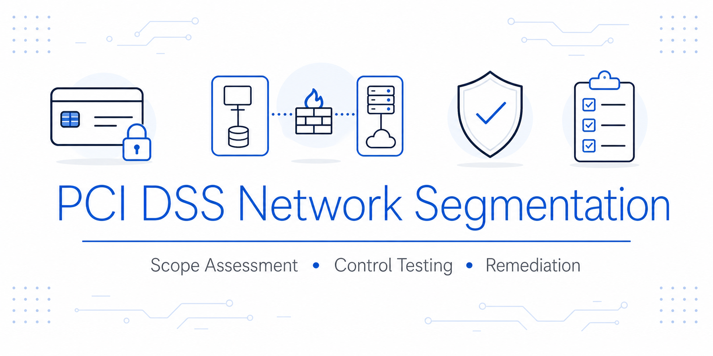
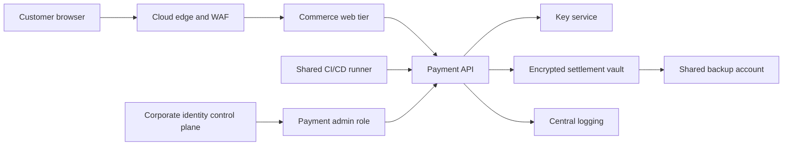

<div align="center">

# PCI DSS Network Segmentation Assurance Review



</div>

This project assesses whether network segmentation is strong enough to reduce PCI DSS scope. It covers cardholder data flows, connected systems, security-impacting services, control gaps, evidence requirements and remediation priorities.

## Executive Summary

The initial scope position limited the cardholder data environment to three payment subnets. The review tests that position against network paths, identity dependencies, deployment access, logging flows and backup administration.

The assessment identified six control gaps. Four shared services materially expand the current assessment boundary: the corporate identity platform, a shared CI/CD runner, the central logging platform and a shared backup vault. Broad internal routing and missing post-change segmentation testing weaken the remaining boundary.

The proposed scope reduction is not supported until the high-priority actions are implemented and independently tested. This is a scoping and control-effectiveness assessment mapped to selected PCI DSS v4.0.1 expectations, not a declaration of compliance.

## Project Context

The environment uses an AWS-hosted payment service with identity, administrative access and operational services shared across the wider enterprise. The review examines whether three payment subnets can be treated as an isolated cardholder data environment.

The detailed architecture, evidence set and assessment boundaries are recorded in the [assessment context](docs/scenario-and-assumptions.md).

## Assessment Decision

**Current decision:** Do not rely on segmentation to reduce PCI DSS scope.

The payment workloads are separated at subnet level, but the security boundary is undermined by shared control-plane dependencies and data flows. The organization should treat the identified connected and security-impacting systems as in scope until isolation is implemented, evidence is collected and segmentation effectiveness is tested.



## What I Delivered

| Artifact | Decision purpose |
|---|---|
| [Assessment context](docs/scenario-and-assumptions.md) | Defines the architecture, evidence set and assessment assumptions |
| [Architecture and data flow](docs/architecture-and-data-flow.md) | Shows cardholder data movement and cross-boundary dependencies |
| [Scope determination](docs/scope-determination.md) | Defines current in-scope, connected and security-impacting systems |
| [Segmentation control assessment](docs/segmentation-control-assessment.md) | Tests the claimed boundary and records six findings |
| [Evidence and test plan](docs/evidence-and-test-plan.md) | Defines evidence needed to support each control conclusion |
| [Risk register and remediation roadmap](docs/risk-register-and-remediation.md) | Prioritizes treatment by risk reduction and dependency |
| [Auditor challenge pack](docs/auditor-challenge-pack.md) | Anticipates questions and prevents unsupported assurances |
| [Executive decision memo](docs/executive-decision-memo.md) | Converts technical findings into an accountable business decision |
| [Source register](docs/source-register.md) | Records the PCI SSC standards and guidance used |

## Method

1. Trace where account data is received, processed, transmitted and stored.
2. Identify systems with connectivity to the CDE and systems that can affect its security.
3. Test each claimed boundary against routes, identity paths, deployment paths and operational data flows.
4. Distinguish evidence available from evidence still required.
5. Record findings, residual risk and a decision on whether scope reduction is defensible.
6. Define the conditions that must be met before reassessment.

## Key Findings

| ID | Finding | Rating | Scope effect |
|---|---|---:|---|
| SEG-01 | Shared CI/CD runner can deploy to payment workloads | Critical | Shared DevOps account is security-impacting |
| SEG-02 | Corporate identity administrators can influence payment roles | High | Identity control plane is security-impacting |
| SEG-03 | Debug logging sends full PAN to the central logging platform | High | Logging platform stores account data |
| SEG-04 | Shared backup operators can restore payment snapshots | High | Backup service and privileged operators are security-impacting |
| SEG-05 | Payment egress permits broad private-network destinations | Medium | Connected-system population is not bounded |
| SEG-06 | Segmentation was not retested after a transit routing change | Medium | Boundary effectiveness is unverified |

## Framework Alignment

| PCI DSS v4.0.1 area | Project response | Evidence |
|---|---|---|
| Scope definition and confirmation | Identifies account-data flows, connected systems and security-impacting systems | [Scope determination](docs/scope-determination.md) |
| Network and data-flow diagrams | Documents current architecture, trust paths and account-data movement | [Architecture and data flow](docs/architecture-and-data-flow.md) |
| Network access restrictions | Assesses inbound, outbound and management paths crossing the claimed boundary | [Segmentation control assessment](docs/segmentation-control-assessment.md) |
| Segmentation effectiveness testing | Defines annual, post-change and evidence-retention expectations | [Evidence and test plan](docs/evidence-and-test-plan.md) |
| Risk and governance accountability | Assigns owners, due dates, acceptance conditions and decision authority | [Risk register](docs/risk-register-and-remediation.md) |

## Repository Structure

```text
.
|-- README.md
|-- LICENSE
`-- docs/
    |-- architecture-and-data-flow.md
    |-- auditor-challenge-pack.md
    |-- banner-prompt.md
    |-- banner.svg
    |-- evidence-and-test-plan.md
    |-- executive-decision-memo.md
    |-- risk-register-and-remediation.md
    |-- scenario-and-assumptions.md
    |-- scope-determination.md
    |-- segmentation-control-assessment.md
    `-- source-register.md
```

## How To Navigate

Start with the [scope determination](docs/scope-determination.md) and [control assessment](docs/segmentation-control-assessment.md). The [evidence plan](docs/evidence-and-test-plan.md), [remediation roadmap](docs/risk-register-and-remediation.md) and [auditor challenge pack](docs/auditor-challenge-pack.md) provide the supporting detail.

## Skills Demonstrated

- PCI DSS scoping and network segmentation assurance
- Cardholder data-flow analysis
- Connected-to and security-impacting system identification
- Evidence design and control-effectiveness testing
- Risk rating, remediation sequencing and residual-risk communication
- Executive reporting and audit challenge preparation

## Scope Note

The project provides an assessment method and documentation set. It does not establish PCI DSS compliance. A compliance conclusion requires validation of the implemented environment, current evidence and applicable assessment procedures.

## References

Primary and secondary materials are documented in the [source register](docs/source-register.md). PCI SSC materials were checked on 14 June 2026.

## License

This project is released under the [MIT License](LICENSE).
