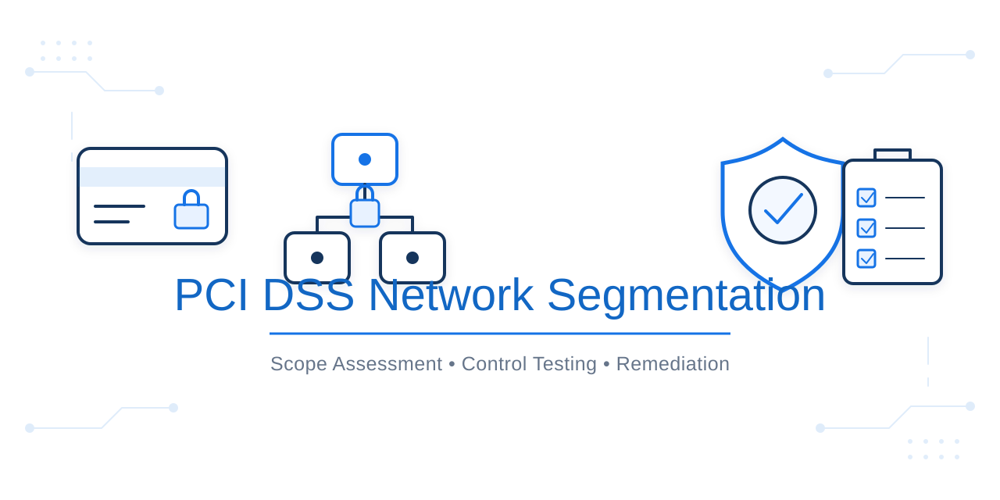
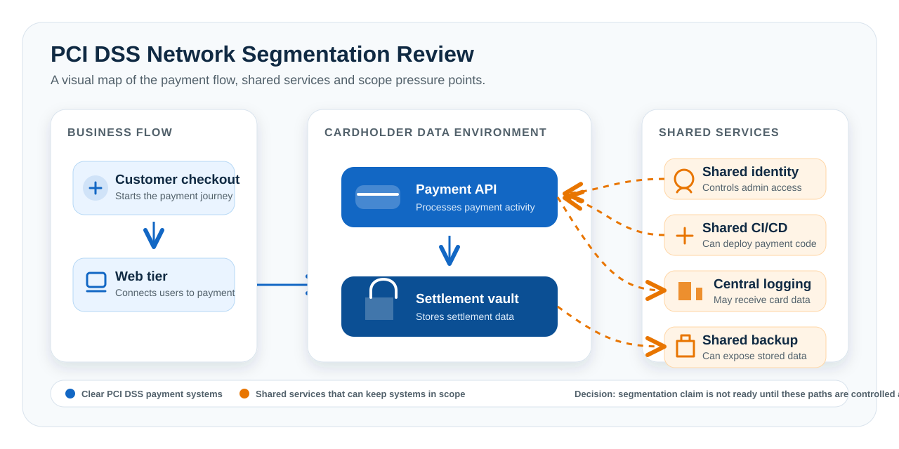

# PCI DSS Network Segmentation Assurance Review



This project looks at a simple but important question:

**Can a company really reduce its PCI DSS scope just because the payment systems sit in separate network segments?**

My answer in this project is **not yet**.

The network is separated on paper, but several shared services still touch the payment environment. Identity, deployment, logging and backup systems can all affect the cardholder data environment. Because of that, the company cannot safely treat those shared services as out of scope until the gaps are fixed and tested.

## Why This Matters

PCI DSS scope is not only about where payment servers sit on a network diagram.

If another system can change, access or receive data from the payment environment, it may still matter for PCI DSS. That is where many segmentation reviews become tricky.

This project shows how I would review a segmentation claim in a practical way:

- Where does cardholder data move?
- Which systems can connect to the payment environment?
- Which shared services could affect payment security?
- What evidence would an assessor expect to see?
- What needs to be fixed before scope can be reduced?

## The Scenario

The environment has a payment application hosted in AWS. The payment systems are placed in dedicated subnets, but they still depend on shared enterprise services.

The goal is to decide whether the company can limit PCI DSS scope to the payment subnets only.



The payment API and settlement vault are the clear payment systems. The shared services are the issue. They are not payment systems, but they can still affect payment security or receive payment data.

## Main Decision

The segmentation claim is too weak in its current state.

The company should not reduce PCI DSS scope to only the payment subnets until the shared services are cleaned up, locked down and tested.

## Key Findings

| Finding | Why it matters | Priority |
|---|---|---|
| Shared CI/CD can deploy to payment systems | A compromised build process could change payment code | Critical |
| Corporate identity can grant payment access | Admin access is controlled outside the payment boundary | High |
| Payment logs include full card data | The logging platform becomes part of the scope | High |
| Backups are managed through a shared service | Backup access can expose payment data | High |
| Network egress is too broad | More internal systems may be reachable than expected | Medium |
| Segmentation testing is out of date | The current boundary has not been proven after changes | Medium |

## What I Built

| Document | What it explains |
|---|---|
| [Assessment context](docs/scenario-and-assumptions.md) | The environment, scope claim and evidence used |
| [Architecture and data flow](docs/architecture-and-data-flow.md) | How payment data and admin access move through the environment |
| [Scope determination](docs/scope-determination.md) | What should be treated as in scope and why |
| [Segmentation control assessment](docs/segmentation-control-assessment.md) | The detailed findings behind the decision |
| [Evidence and test plan](docs/evidence-and-test-plan.md) | What proof is needed before the boundary can be trusted |
| [Risk register and remediation roadmap](docs/risk-register-and-remediation.md) | What to fix first and who should own it |
| [Auditor challenge pack](docs/auditor-challenge-pack.md) | Questions an assessor may ask and how to prepare |
| [Executive decision memo](docs/executive-decision-memo.md) | A short summary for leadership |
| [Source register](docs/source-register.md) | PCI SSC sources used for the project |

## How I Approached It

I did not start by accepting the diagram.

I started by following the data and the trust paths:

1. Identify where cardholder data is received, processed, stored and sent.
2. Check which systems connect to the payment environment.
3. Check which shared services can change or affect payment systems.
4. Review logging, backup, identity and deployment paths.
5. List the gaps that weaken the segmentation claim.
6. Define what evidence is needed before the scope can be reduced.

## What Needs To Change

The biggest fixes are straightforward:

- Move payment deployments to a dedicated CI/CD runner.
- Separate payment admin access from normal corporate identity administration.
- Remove card data from logs and check old log data.
- Put payment backups under dedicated access controls.
- Replace broad network routes with specific approved paths.
- Run a fresh segmentation test after the changes are made.

## Skills Shown

| Skill | How this project shows it |
|---|---|
| PCI DSS scoping | Defines what should and should not be in scope |
| Network segmentation review | Tests whether the boundary works in practice |
| Data-flow analysis | Follows where cardholder data moves |
| Access review | Looks at identity, admin and deployment paths |
| Evidence planning | Lists what proof is needed for each conclusion |
| Risk communication | Turns technical issues into clear business decisions |

## Repository Structure

```text
.
|-- README.md
|-- LICENSE
`-- docs/
    |-- architecture-and-data-flow.md
    |-- auditor-challenge-pack.md
    |-- banner-prompt.md
    |-- banner.svg
    |-- evidence-and-test-plan.md
    |-- executive-decision-memo.md
    |-- risk-register-and-remediation.md
    |-- scenario-and-assumptions.md
    |-- segmentation-overview.svg
    |-- scope-determination.md
    |-- segmentation-control-assessment.md
    `-- source-register.md
```

## How To Read This Project

Start with the [scope determination](docs/scope-determination.md) if you want the final decision.

Read the [architecture and data flow](docs/architecture-and-data-flow.md) if you want to understand the environment.

Review the [segmentation control assessment](docs/segmentation-control-assessment.md) if you want the detailed findings.

Use the [evidence and test plan](docs/evidence-and-test-plan.md) and [remediation roadmap](docs/risk-register-and-remediation.md) to see what should happen next.

## Scope Note

This project is an example of how to structure a PCI DSS segmentation review. It does not claim that any real company is PCI DSS compliant. A real compliance decision would require current evidence, testing and review by the organization and its assessor.

## References

Primary sources are listed in the [source register](docs/source-register.md). PCI SSC materials were checked on 14 June 2026.

## License

This project is released under the [MIT License](LICENSE).
