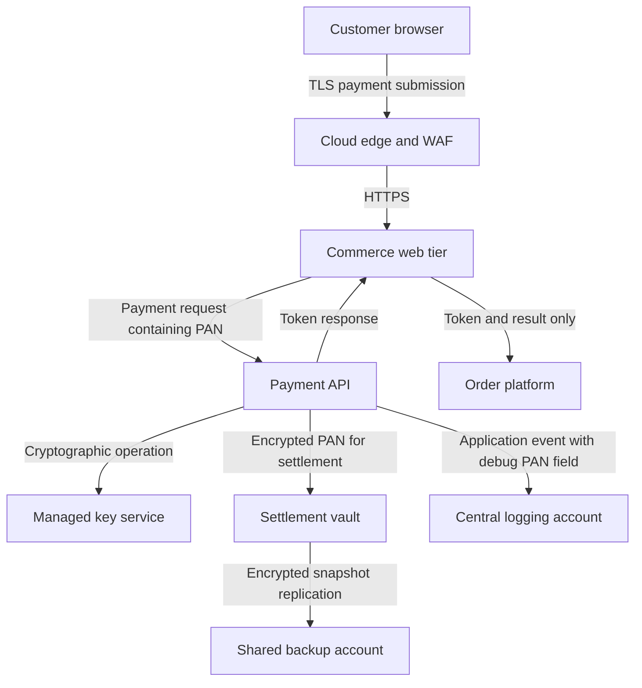
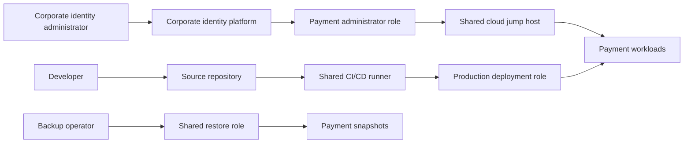

# Architecture And Data Flow

## Purpose

This artifact traces account data and administrative influence across the claimed segmentation boundary. The diagrams represent the simulated current state, not a production network.

## Account Data Flow

The CDE therefore includes more than the payment API subnet. The cloud edge and commerce tier transmit PAN. The key service supports protection of stored data. The settlement vault stores encrypted PAN. The logging platform receives PAN through a defective debug field and the backup account receives copies of the settlement dataset.

## Administrative And Change Paths

These paths matter even when they do not carry PAN. A compromised identity administrator, deployment runner or backup restore role can alter payment controls, deploy malicious code or expose stored account data. They are assessed as security-impacting dependencies.

## Network Zones

| Zone | Example range | Purpose | Current assessment position |
|---|---|---|---|
| Public edge | Managed service | Internet termination and filtering | In scope because it transmits payment traffic and can affect security |
| Commerce | 10.40.10.0/24 | Web and checkout services | In scope because PAN crosses the tier |
| Payment | 10.40.20.0/24 | Payment API and cryptographic calls | CDE |
| Settlement | 10.40.30.0/24 | Encrypted settlement storage | CDE |
| Shared management | 10.50.0.0/16 | Identity, jump host and CI/CD | Security-impacting and currently in scope |
| Shared operations | Separate AWS accounts | Logging and backup | In scope due to data receipt and privileged restore access |
| Corporate user | 10.60.0.0/16 | General workstations | Exclusion not yet proven because private egress is too broad |

## Boundary Failure Points

1. The shared CI/CD runner can change executable code inside the CDE.
2. Corporate identity administrators can change who receives payment privileges.
3. The payment API sends full PAN to a logging account outside the declared boundary.
4. Shared backup operators can restore payment snapshots.
5. Payment egress rules permit destinations beyond documented operational dependencies.
6. A transit routing change occurred without a new independent segmentation test.

## Target-State Principle

The target state should minimize both account-data movement and administrative influence. Dedicated payment deployment infrastructure, separated privileged identity, PAN-safe logging, isolated backup administration and deny-by-default routing provide stronger scope-reduction evidence than additional VLAN labels alone.
